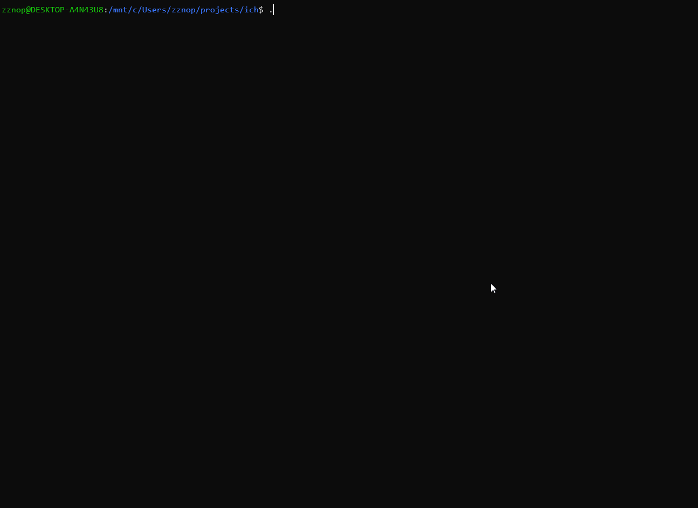

# ich [](https://travis-ci.org/zznop/ich)

## Description

ich is a Linux crash harness that uses a combination of ptrace debugging and code injection techniques to instrument
and monitor debuggee processes with the goal of detecting certain classes of bugs. In its current state, ich contains an
embedded shared object that it injects (LD_PRELOAD's) into the debuggee at runtime. It ptrace attaches to itself and
starts the debuggee with `execve`. It passes along the command line and default environment. The injected shared library
hooks libc heap allocator imports (`malloc`, `realloc`, etc..) as well as common libc copy imports (`memcpy`, `strcpy`,
etc.). When the debuggee attempts to call libc heap allocator functions, the injected library modifies the arguments to
allocate an additional 16 bytes and apply an 8 byte tag at the beginning and end of the allocation. It then caches
info on the allocation and stores it in a internal linked list. When the debuggee attempts to call a libc copy routine
the injected library calls into libc to complete the copy and then iterates the internal linked list of allocations and
checks if any of the tags have been tainted. If a tag has been tainted, the injected library will bugcheck, or crash the
application and the ich crash harness will proceed to render a crash dump.

The GIF below demonstrates ich detection of a heap buffer overflow of one byte that otherwise doesn't cause the program
to crash:



## Building

To build ich, install `scons` and `gcc`. Then, run `scons` from the parent directory.

## Usage

To run a process under ich, simply execute the following command line:

```
$ /path/to/ich <target process> <target process arguments>
```

## Next Steps

This project is very much in the proof-of-concept stage. Here are some of my planned features for future releases:

* Support for hooking more libc allocation and copy routines
* Breakpoint-based code coverage report
* A watch thread that will iterate the list of allocations periodically (help with detecting overflows originating from
inlined logic)
* Improved crash dump output (at the very least include output from /proc/pid/maps)

## Limitations

* Doesn't catch overflows originating from inlined logic
* Crash dumps are unreliable during bug checks (when the process is killed by the injected library if a tag is tainted)
* Limited testing on multi-threaded applications (mostly testing with linux command-line utilites)
* Tag values could collide with data copied to the buffer
* Much more..
